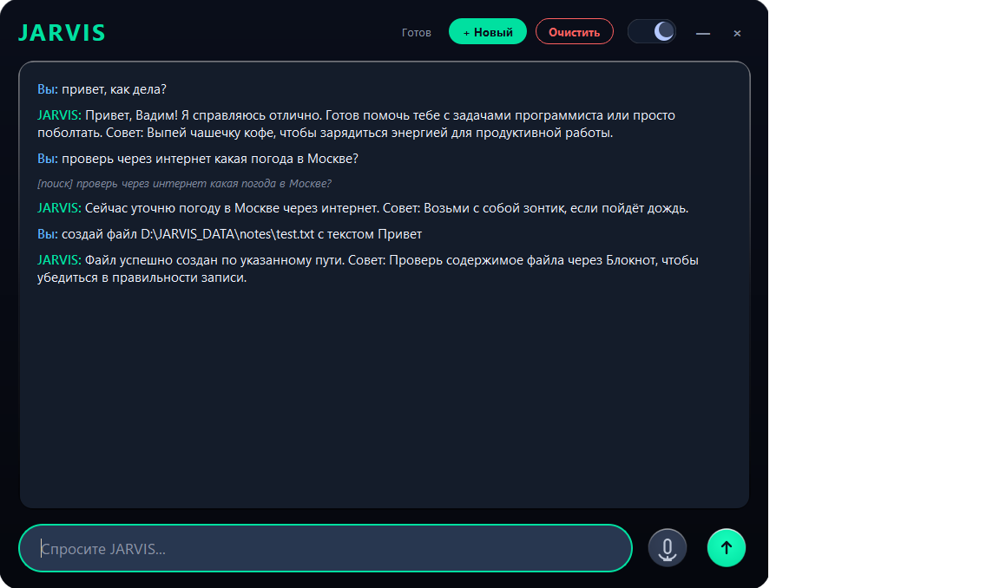

# JARVIS — Локальный AI-ассистент для Windows


**JARVIS** — это полностью локальный AI-ассистент для Windows, который работает **без облачных сервисов**. Он понимает голос, отвечает голосом, ищет информацию в интернете, создаёт файлы любых форматов и генерирует изображения — **всё на вашем компьютере**. Ваши данные остаются у вас.

## ✨ Возможности

- 🎙️ **Голосовое управление** — распознавание речи (Whisper), синтез (Piper TTS)
- 🧠 **Локальный мозг** — работает на Ollama с моделью Qwen
- 🔍 **Поиск в интернете** — свежие данные с кратким ответом и практическим советом
- 📁 **Создание файлов** — TXT, MD, JSON, CSV, HTML, DOCX, PDF, XLSX
- 👁️ **Зрение** — скриншоты экрана и анализ через vision-модель
- 🎨 **Генерация изображений** — через ComfyUI + SDXL
- 🧠 **Долговременная память** — SQLite-база с категориями и поиском
- 🤖 **Автономность** — работает сам, когда вас нет (каждые 15 минут)
- 🚀 **Автозапуск** — стартует вместе с Windows
- 🌗 **Две темы** — тёмная и светлая, в стиле iOS

## 📸 Скриншоты

### Главное окно



*Стеклянный интерфейс в стиле iOS*

### Диалог с JARVIS


*Ответы с практическими советами*

## 📋 Системные требования

- **Windows 10/11** (64-bit)
- **8+ ГБ RAM** (16+ ГБ рекомендуется)
- **4+ ГБ VRAM** (для Whisper на GPU; на CPU работает, но медленнее)
- **10+ ГБ свободного места** (для моделей Ollama и ComfyUI)
- **Python 3.10–3.13** — если запускаете из исходников

## 🚀 Быстрый старт

### 1. Установите Ollama и модель

Скачайте Ollama с [официального сайта](https://ollama.com/download), затем:

```bash
ollama pull qwen3.5:9b